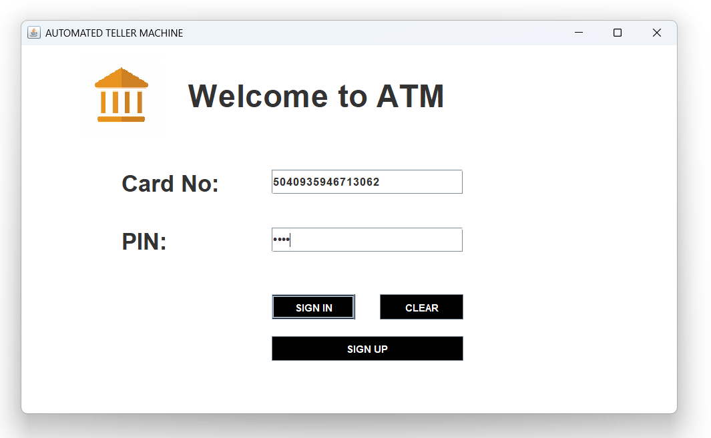
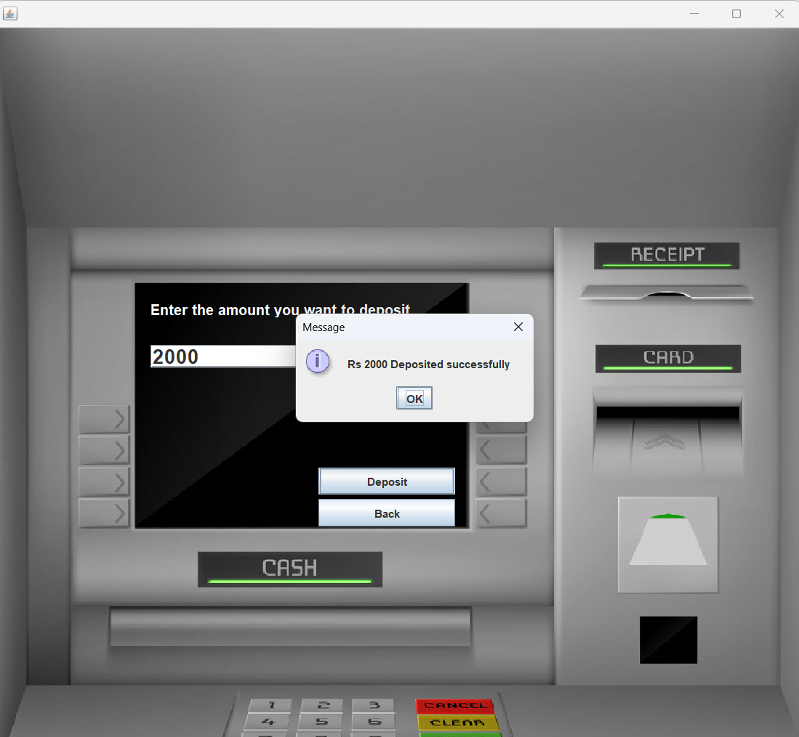
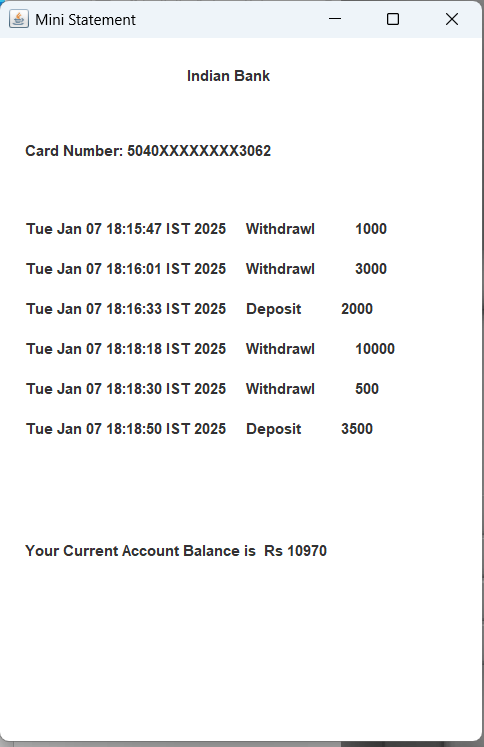
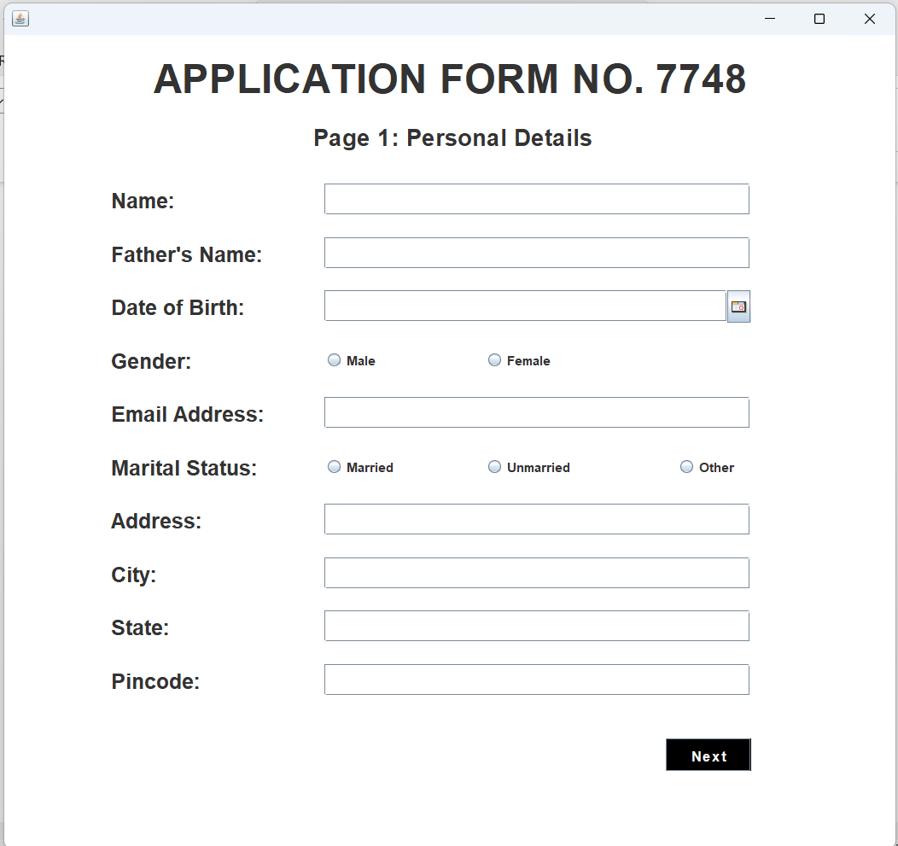
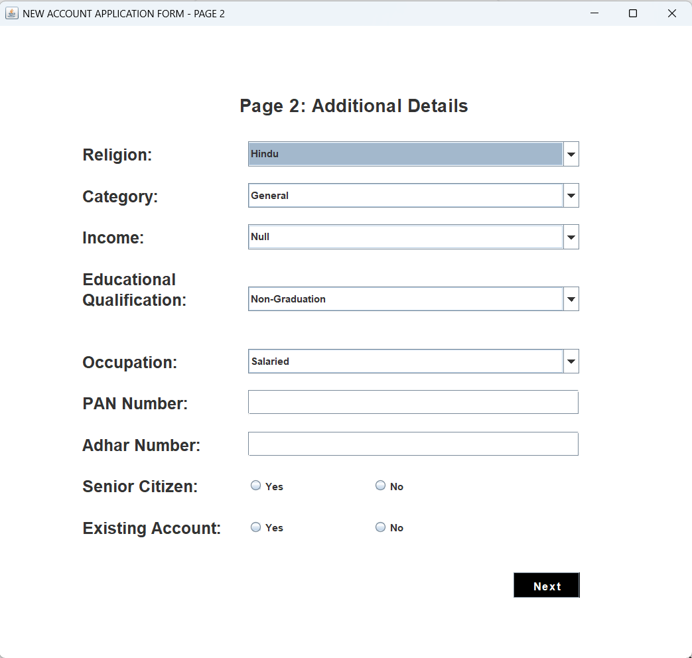
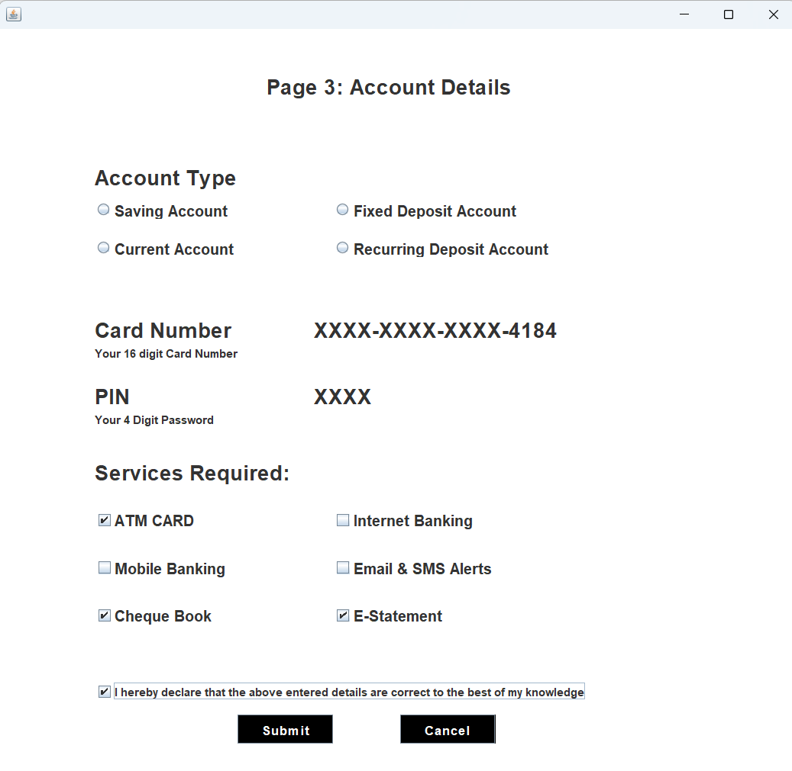

# 🏦 Bank Management System (Java + MySQL)

A simple **Bank Management System** built using **Java (Swing, AWT)** and **MySQL**.  
This project simulates core banking operations like account creation, deposits, withdrawals, and balance inquiry — all through an interactive GUI interface.

---

## 🚀 Features

✅ User Registration & Login  
✅ Account Details Management  
✅ Deposit & Withdrawal Operations  
✅ Transaction History Tracking  
✅ Secure Database Connection (MySQL)  
✅ Modern Swing-based UI  

---

## 🧩 Tech Stack

| Layer | Technology Used |
|-------|------------------|
| **Frontend (UI)** | Java Swing, AWT |
| **Backend** | Java |
| **Database** | MySQL |
| **IDE / Tools** | VS Code / Apache NetBeans |
| **Build** | Manual using `javac` and `java` commands |

---

## ⚙️ Installation & Setup

### 1️⃣ Clone the Repository
```bash
git clone https://github.com/Sameeksha-nayak15/BankManagementSystem.git
cd BankManagementSystem

2️⃣ Setup Database

Open MySQL Workbench or CLI.

Create a new database:

CREATE DATABASE bankmanagementsystem;
USE bankmanagementsystem;


Create the required tables (depending on Java code structure — login, signup, signuptwo, signupthree etc.).

3️⃣ Add Required Libraries

Ensure you have the following JARs inside the lib/ folder:

lib/
├── mysql-connector-j-9.5.0.jar
├── jcalendar-1.4.jar

4️⃣ Compile and Run the Project
javac -d bin -cp "lib/*" src/bank/management/system/*.java
java -cp "bin;lib/*" bank.management.system.Login

🖥️ Screenshots


### 🔹 Login Page



### 🔹 Deposit Page


### 🔹 Mini_Statement Page


### 🔹 Form1 Page


### 🔹 Form2 Page


### 🔹 Form3 Page


## Getting Started

Welcome to the VS Code Java world. Here is a guideline to help you get started to write Java code in Visual Studio Code.

## Folder Structure

The workspace contains two folders by default, where:

- `src`: the folder to maintain sources
- `lib`: the folder to maintain dependencies

Meanwhile, the compiled output files will be generated in the `bin` folder by default.

> If you want to customize the folder structure, open `.vscode/settings.json` and update the related settings there.

## Dependency Management

The `JAVA PROJECTS` view allows you to manage your dependencies. More details can be found [here](https://github.com/microsoft/vscode-java-dependency#manage-dependencies).
